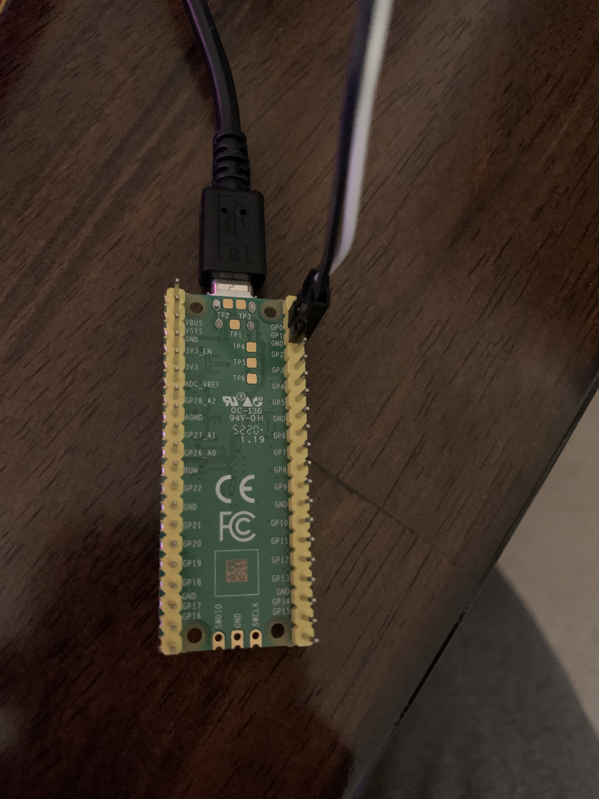
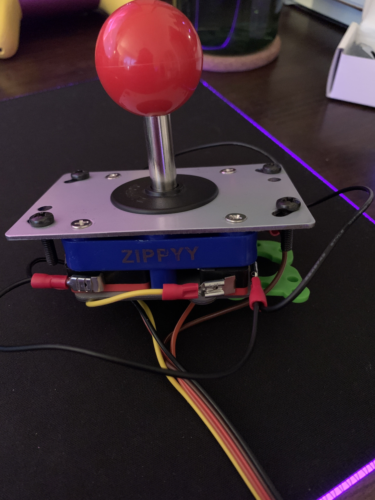

# sequential-shifter

## Setup

1. Install [Circuit Python](https://circuitpython.org/board/raspberry_pi_pico/) on your Raspberry Pi Pico
2. Wire up your Pi Pico to your joystick (see below)
3. Drag `code.py` and `/lib` from this repository into the root of your Pi
4. Plug your Pico Pi into your computer (it will display as a joystick that you can map to controls in games)

## Finished Product

> There are rubber feet on the bottom now and I use a velcro Command Strip to attach it to my Logitech driving wheel for stability.

## Components

The project uses a [Raspberry Pi Pico](https://www.raspberrypi.org/products/raspberry-pi-pico/):

The Pi Pico listens for input from this joystick:

